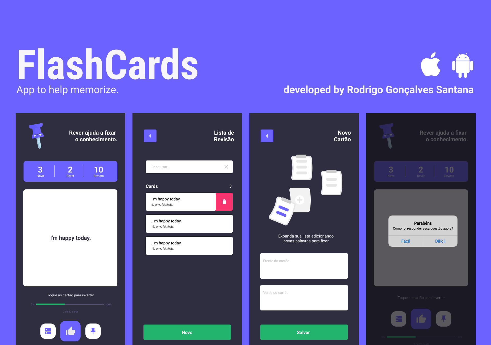

# Flash.Cards

App to help memorize. This application was created for the purpose of studies.

## Stack

- React Native
- Typescript
- Expo
- Renimated v2
- Moti
- React Native SVG
- And more...

## Running

You have two branchs. The master you have project base with layout design only. And, the done you have the project finished with charts implemented.

Clone this project and start with Expo:

```bash
  git clone branch_url
  cd expensesapp
  npm install
  expo start
```

</div>
